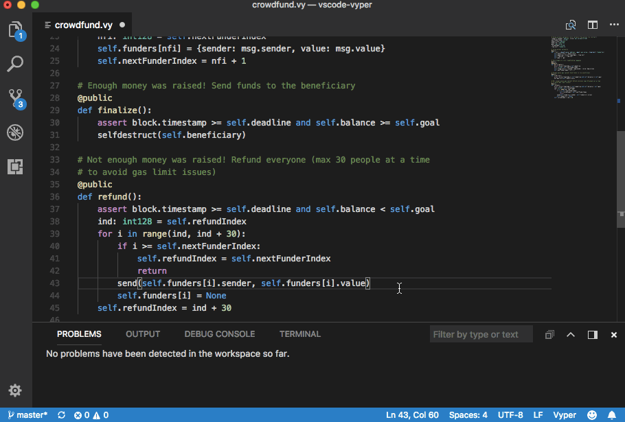

# vscode-vyper alpha

This extension brings the [Vyper](https://github.com/ethereum/vyper) smart contract language for Ethereum to Visual Studio Code. Like Vyper itself (and even more so) this extension is alpha software and should just be used to toy around with vyper. Compatibility with later versions of 

In it's current state this extension is just the result of hacking the [Python highlighting support](https://github.com/Microsoft/vscode/tree/master/extensions/python) together with the ability to call command line tools from the [Go extension](https://github.com/Microsoft/vscode-go).

## Features

* Provides the `Vyper: Build Contract` command that when called on a saved file shows the actual build errors.
* Syntax Higlighting for Vyper (*.vy, *.v.py) files.

This is how it could look like if Vyper is installed as required:

## Requirements

[Visual Studio Code](https://code.visualstudio.com/) 1.2 or later

Requires a virtual Vyper 0.0.3 env to be set up exactly as described in the [Vyper tutorial](https://vyper.readthedocs.io/en/latest/installing-vyper.html).
This means that the folder `~/vyper-venv/bin` should contain a `python` and a `vyper` executable.

## Extension Settings

Coming eventually...

## Known Issues

Requires a virtual Vyper env to be set up exactly as described in the [Vyper tutorial](https://vyper.readthedocs.io/en/latest/installing-vyper.html).
This means that the folder `~/vyper-venv/bin` should contain a `python` and a `vyper` executable.

## Development

You're gladely invited to help with the development of this extension!

To start and debug this extension:

1. Clone this repo
2. Open it in VS Code
3. Press F5 to start a dev environment with this extension running
