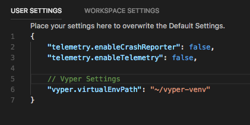
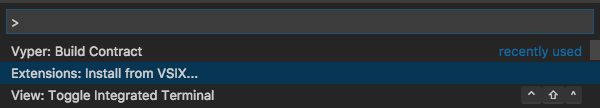

# Vyper for VS Code (alpha)

This extension brings the [Vyper](https://github.com/ethereum/vyper) smart contract language for Ethereum to Visual Studio Code (a mix between editor and IDE). Like Vyper itself (and even more so) this extension is alpha software and should just be used to toy around with vyper. Compatibility with later versions cannot be guaranteed. 

This extension is basically the result of hacking the [Python highlighting support](https://github.com/Microsoft/vscode/tree/master/extensions/python) together with the ability to call command line tools from the [Go extension](https://github.com/Microsoft/vscode-go) and displaying the results of the StdError in a user-friendly way.

## Features

* Provides the `Vyper: Build Contract` command that when called on a saved file shows the actual build errors.
* Syntax Higlighting for Vyper (*.vy, *.v.py) files inclusive Vyper specific types like `int128`.
* Build on Save

Vyper for VS Code in action:

## Requirements

[Visual Studio Code](https://code.visualstudio.com/) 1.2 or later

Requires a virtual Vyper 0.0.3 env to be set up exactly as described in the [Vyper tutorial](https://vyper.readthedocs.io/en/latest/installing-vyper.html).
This means that the folder `~/vyper-venv/bin` should contain a `python` and a `vyper` executable.

## Extension Settings

The path to the virtual Python environment can be set in the User Settings (`Ctrl+Shift+P`) + 'Open User Settings' via the `vyper.virtualEnvPath` variable.

The 'Build on Save' feature can be disabled with the `vyper.buildOnSave` setting property.
## Installation

This extension is not published (and maybe never will).

To manually install it:

1. Download the `vscode-vyper-0.0.x.vsix` from the root of this repo
2. Inside VS Code: Call the `Extensions: Install from VSIX...` command via the command palette (`Ctrl+Shift+P`)
3. Select the downloaded file. And you're ready to go!

## Development

You're gladely invited to help with the development of this extension!

To start and debug this extension:

1. Clone this repo
2. Open it in VS Code
3. Press F5 to start a dev environment with this extension running
